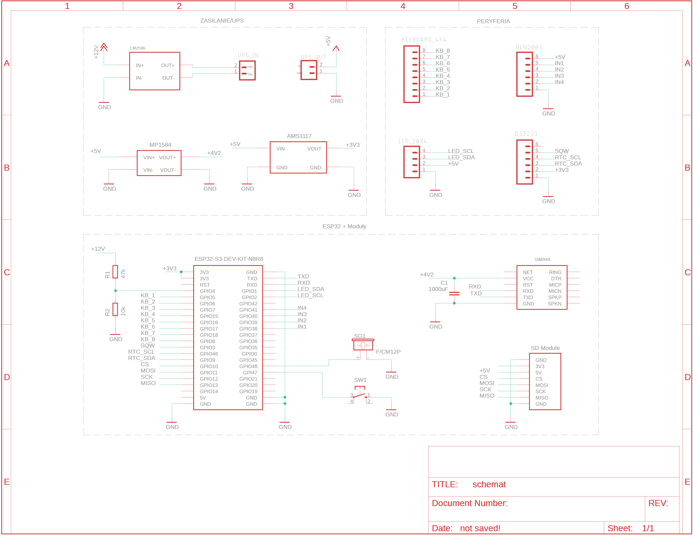
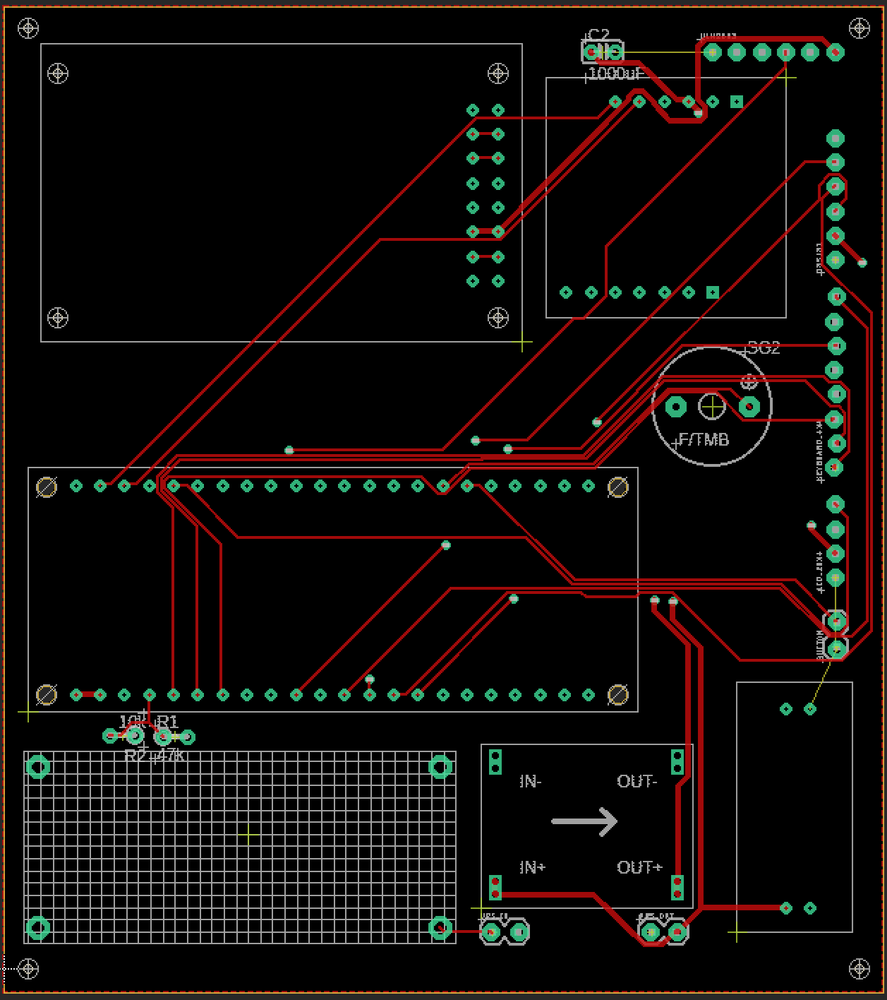
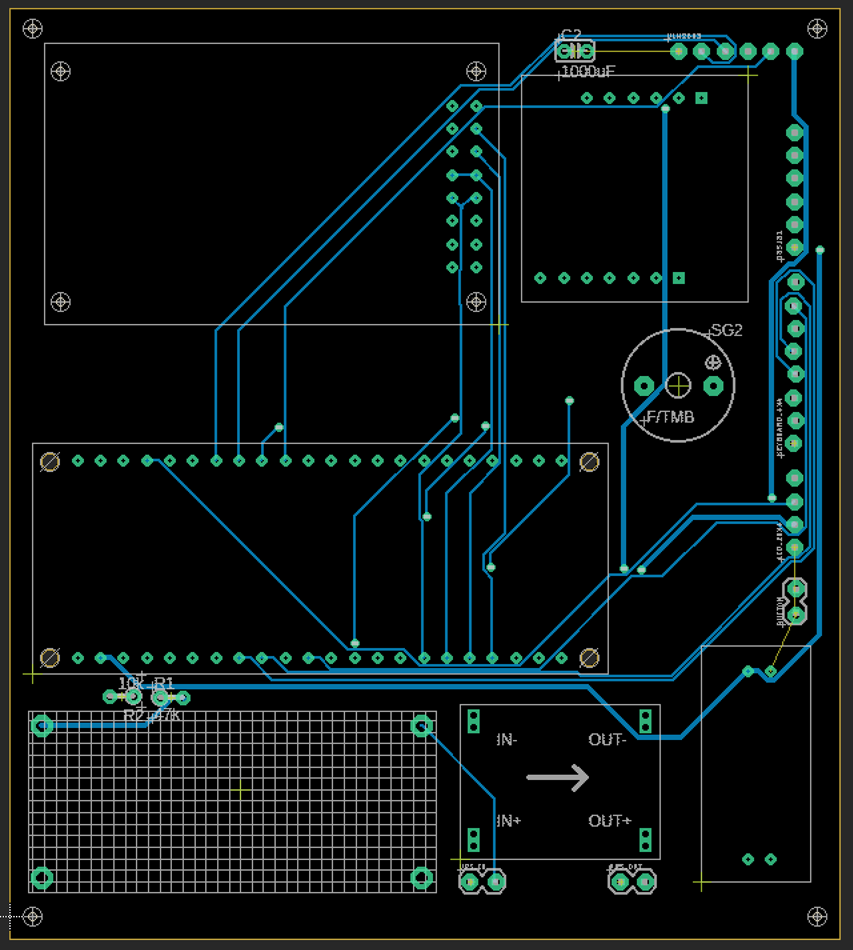
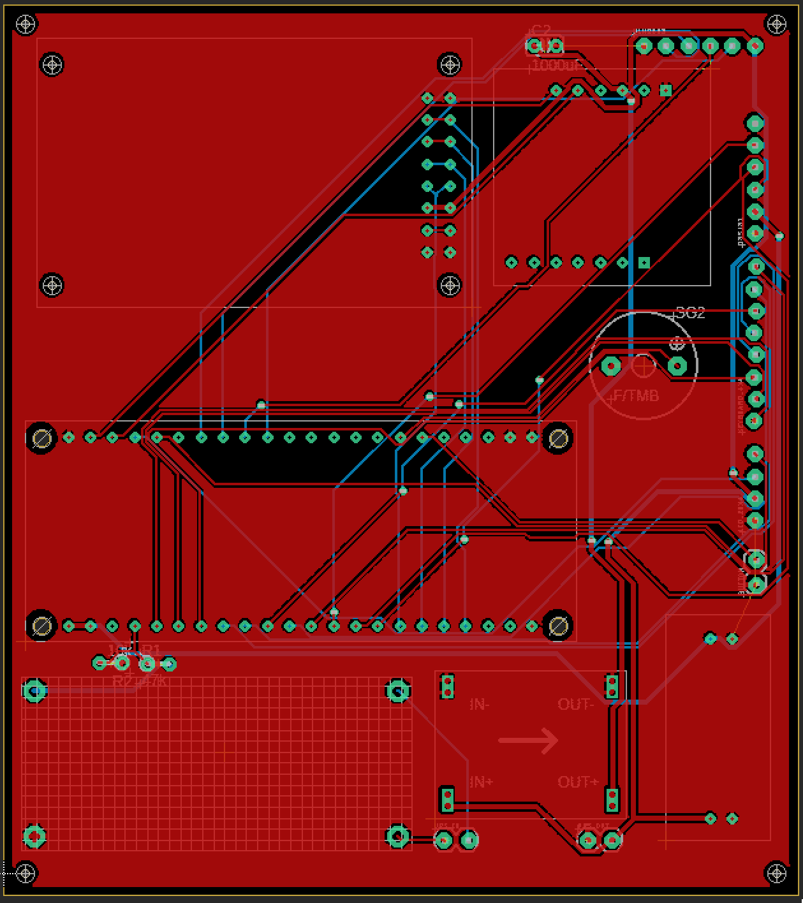

# IoT Medicine Dispenser

An automated powered pill dispenser designed to ensure that medication is taken exactly when needed. It features a web-based configuration panel, GSM text messaging, email notifications, and physical alarms.

This project marks my very first journey into the world of IoT, soldering, and custom PCB design. It was a massive learning experience - from designing the circuitry to writing the C++ logic, and piecing together the hardware.

## The Problem It Solves

Managing daily medication can be incredibly stressful and confusing, especially for elderly individuals or those suffering from early stages of dementia. Common issues include:
* **Losing track of time:** Forgetting what day of the week it is or whether it's morning or evening.
* **Double dosing or missing doses:** Confusion often leads to taking pills twice or skipping them entirely, which can be highly dangerous.
* **Caregiver anxiety:** Family members constantly worry if their loved ones have taken their life-saving medications.

This smart dispenser eliminates these risks. It holds the medication securely in a motorized magazine and only dispenses it at the exact scheduled time. If the patient forgets or ignores the visual and auditory alarms, the device automatically alerts caregivers via SMS and Email, giving them peace of mind and the ability to react immediately.

## Features

* **Automated Dispensing:** Uses a stepper motor to rotate a 21-slot pill magazine.
* **Web Configuration Panel:** Connect to the device via WiFi to easily set up dose times, email addresses, phone numbers, and WiFi credentials.
* **Triple Notification System:** 
  1. **Visual & Audio:** LCD screen and buzzer alert the patient.
  2. **SMS Alerts:** Uses a SIM800L GSM module to send a text message if a dose is missed.
  3. **Email Reports:** Sends SMTP email notifications (along with SD card logs) to a caregiver.
* **Offline RTC:** Keeps precise time using a DS3231 module, even if the Internet drops.
* **SD Card Logging:** Every action (pill taken, missed dose, error) is logged securely on an SD card.
* **Admin Keypad:** Physical 4x4 keypad to access settings, run diagnostic tests, and manually dispense pills directly from the device.

## Hardware Stack

* **Microcontroller:** ESP32-S3
* **GSM Module:** SIM800L
* **Motor:** 28BYJ-48 Stepper Motor + ULN2003 Driver
* **Display:** 20x4 I2C LCD Display
* **RTC:** DS3231 Real-Time Clock
* **Memory:** MicroSD Card Module
* **Input:** 4x4 Membrane Keypad & Push Button
* **Feedback:** Active Buzzer

## Code Structure

* `IoT-Medicine-Dispenser.ino` - Main loop and setup
* `Config.h` - Pinout definitions and hardcoded constants
* `WebPage.h` - HTML/CSS for the configuration portal
* `Communication` - WiFi, Email (SMTP), and SMS logic
* `MotorControl` - Stepper motor and dispensing logic
* `WebServerManager` - Endpoints and web server handling
* `AdminMenu` - Physical keypad logic and LCD menus

## Hardware & PCB

### Schematic

### PCB Layout (Top & Bottom)

